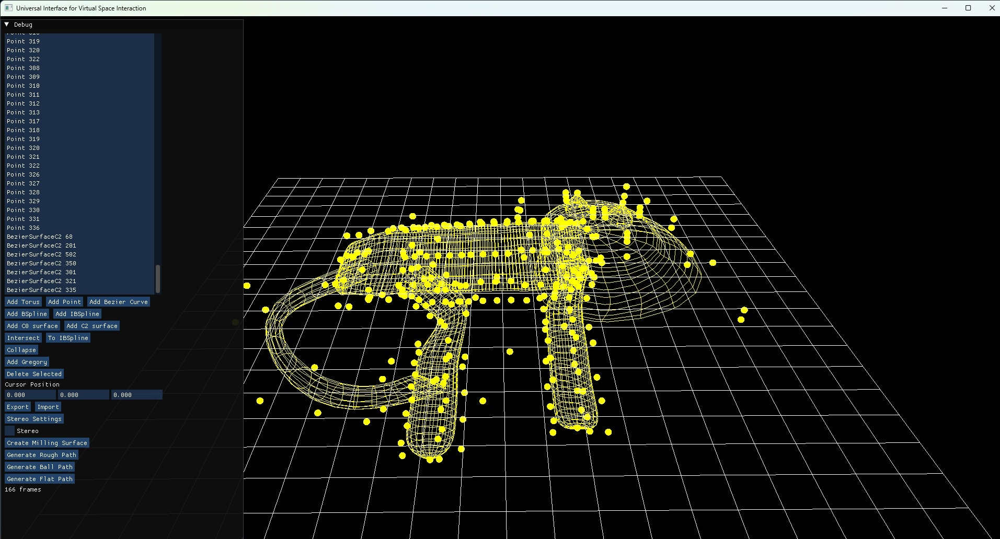
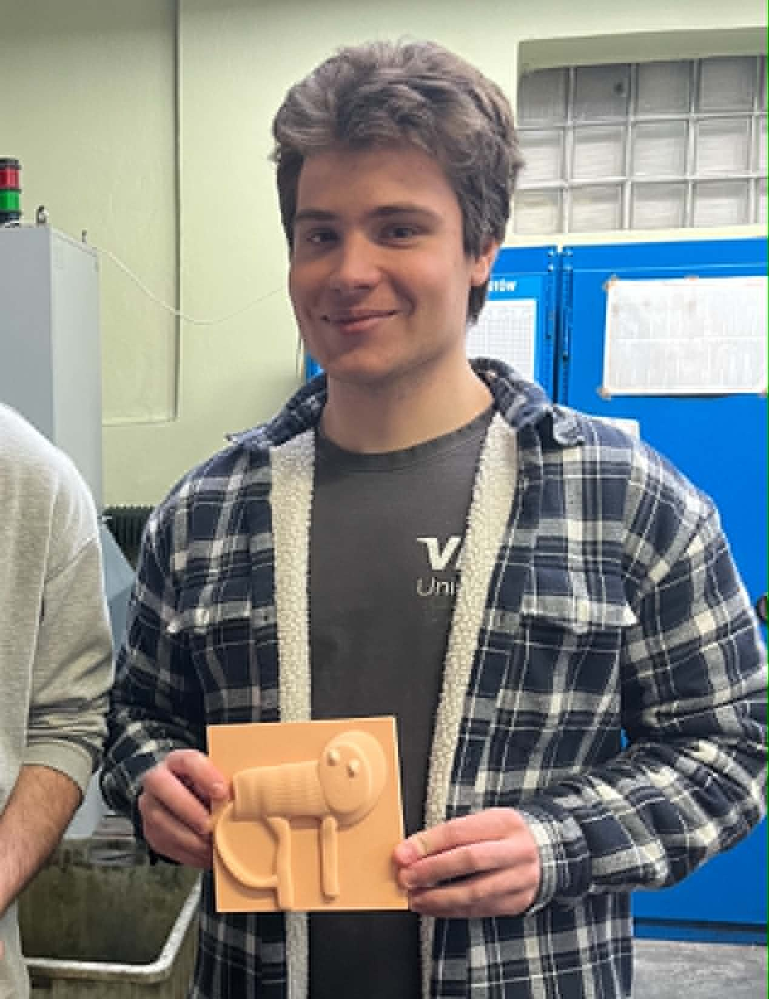
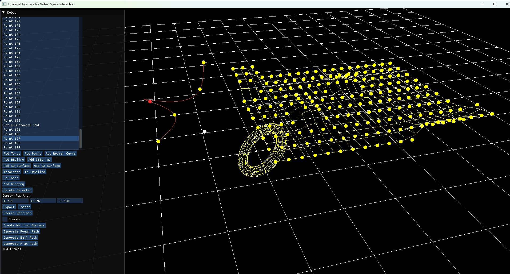

# UIFVSI

Universal Interface for Virtual Space Interaction is a CAD/CAM software focused on geometric modeling, surface editing, and manufacturing preparation.

## Getting started

### Clone the repository

To clone the project with all nested dependencies included, use:

```bash
git clone --recursive https://github.com/adamowski137/UIFVSI.git
```

### Prerequisites

- CMake 3.30 or newer
- A C++20-compatible compiler
- OpenGL support
- A Windows development environment such as Visual Studio or Ninja with MSVC

### Configure and build

From the repository root, configure the project with CMake and build it:

```bash
cmake -S . -B build
cmake --build build 
```

### Run the application

After the build completes, run the executable from the generated output folder, typically:

```bash
./build/Debug/uifvsi.exe
./build/uifvsi
```

The project copies its shader assets into the runtime directory during the build, so you can start working with the application immediately after a successful build.

## Purpose

UIFVSI combines modeling, analysis, and manufacturing preparation in one workflow, allowing users to design 3D geometry and prepare it for physical production through generated cutting paths.

## Overview

This application is capable of creating and manipulating a wide range of geometric objects, including:

- toruses
- points
- Bézier C0 curves
- Bézier C2 curves
- interpolating Bézier curves
- Bézier C0 surfaces
- Bézier C2 surfaces

The system can also generate Gregory patches to fill holes in surfaces, making it useful for repairing and extending complex models.

## Modeling and editing capabilities

The software supports working with free-form surface models, including advanced patch-based workflows for geometry completion and surface refinement. It also provides tools for:

- importing and exporting generated models
- finding intersections between two surfaces
- trimming parts of surfaces based on those intersections
- generating milling paths for manufactured parts

These capabilities make the project suitable for both digital model design and downstream real-world fabrication workflows.

## Example outputs

### Example model created in the software



This example shows a model of a cat created directly in the application.

### Real-world result after milling



This image shows the cat shape milled into a wooden table after the toolpaths were generated from the modeled geometry.

### Example object types available in the system



This image presents representative objects that can be added and manipulated within the system.
